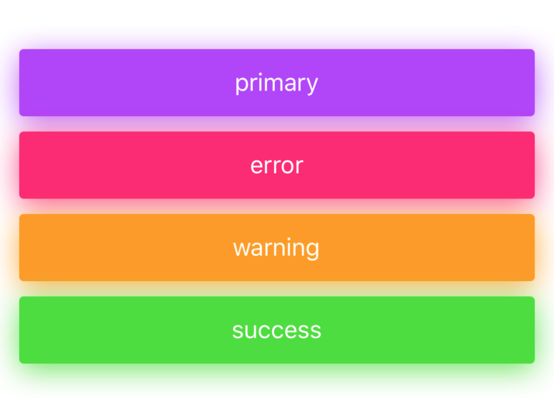
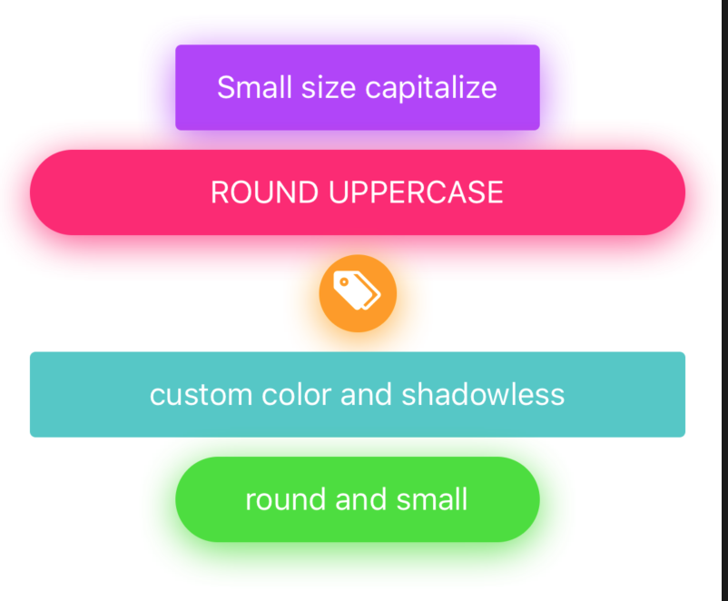

# Button
A nice button which suits even the most picky developers.

<p align="center">
 
</p>

### Usage
Imports:
```js
import { Button } from 'galio-framework';
```



Code example:
```jsx
<Button>primary</Button>
<Button color="info">info</Button>
<Button color="success">success</Button>
<Button color="warning">warning</Button>
<Button color="error">error</Button>
```



Code example:
```jsx
<Button capitalize size="small">small size capitalize</Button>
<Button round uppercase color="error">round uppercase</Button>
<Button onlyIcon icon="tags" iconFamily="antdesign" iconSize={30} color="warning" iconColor="#fff" style={{ width: 40, height: 40 }}>warning</Button>
<Button color="#50C7C7" shadowless>custom color and shadowless</Button>
<Button round size="small" color="success">round and small</Button>
```

### Props

|              Prop             |     Type     |       Default      |                                              Description                                             |
|:-----------------------------:|:------------:|:------------------:|:----------------------------------------------------------------------------------------------------:|
| ...TouchableOpacity.propTypes |              |                    |                                                                                                      |
| capitalize                    |     bool     |        false       | Transforms the first character in a capital letter                                                   |
| color                         |    string    |      'primary'     |  your options are: 'primary', 'theme', 'error', 'warning', 'succes', 'transparent' or your own color |
| disabled                      |     bool     |        false       |                                          Disables the button                                         |
| icon                          | bool, string |        false       |                             pick whatever icon you want from Expo's icons                            |
| iconColor                     | bool, string | theme.COLORS.BLACK | sets the icon's color                                                                                |
| iconFamily                    | bool, string |        false       | pick whatever icon family suits the icon you chose from Expo's icons                                 |
| iconSize                      |    number    |         14         |                                         sets the icon's size                                         |
| loading                       |     bool     |        false       |                         Uses the <ActivityIndicator /> for the loading effect                        |
| loadingSize                   |    string    |       'small'      |                                  your options are: 'small', 'large'                                  |
| lowercase                     |     bool     |        false       | makes all letters lowercase                                                                          |
| onlyIcon                      |     bool     |        false       | adds specific styling for using only an icon in your button                                          |
| opacity                       |    number    |         0.8        | changes the button's opacity                                                                         |
| radius                        |    number    |          0         | changes the button's radius                                                                          |
| shadowColor                   | bool, string |        false       | the default shadowColor is based on the button's color but you can also write a specific shadowColor |
| shadowless                    |     bool     |        false       | removes shadow                                                                                       |
| size                          |    number    |       'large'      | your options are: 'large', 'small'                                                                   |
| uppercase                     |     bool     |        false       | makes all letters uppercase                                                                          |
