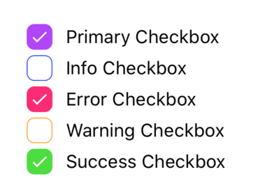
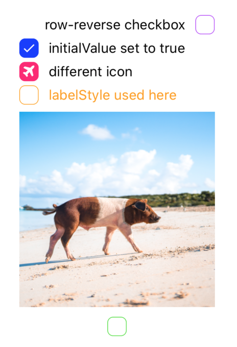
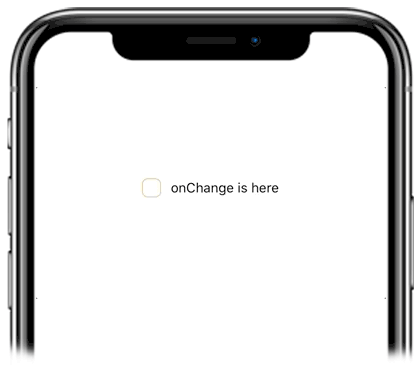

# Checkbox 

Checkboxes allow users to complete tasks that involve making choices such as selecting options, or switching settings on or off. 

<p align="center">
  
</p>

### Usage
Imports:
```js
import { Checkbox } from 'galio-framework';
```



Code example:
```jsx
<Checkbox color="primary" label="Primary Checkbox" />
<Checkbox color="info" label="Info Checkbox" />
<Checkbox color="error" label="Error Checkbox" />
<Checkbox color="warning" label="Warning Checkbox" />
<Checkbox color="success" label="Success Checkbox" />
```



Code example:
```jsx
<Checkbox color="primary" flexDirection="row-reverse" label="row-reverse checkbox" />
<Checkbox color="info" initialValue={true} label="initialValue set to true" />
<Checkbox color="error" initialValue={true} label="different icon" iconFamily="font-awesome" iconName="plane" />
<Checkbox color="warning" labelStyle={{ color: '#FF9C09' }} label="labelStyle used here" />
<Checkbox color="success" image="https://images.unsplash.com/photo-1569780655478-ecffea4c165c?ixlib=rb-1.2.1" flexDirection="column-reverse"/>
```



Code example:
```jsx
<Checkbox color="warning" onChange={() => alert('Galio is cool')} label="onChange is here" />
```

### Props
|      Prop     |                                Type                               |    Default    |                                              Description                                             |
|:-------------:|:-----------------------------------------------------------------:|:-------------:|:----------------------------------------------------------------------------------------------------:|
| checkboxStyle |                                any                                |      null     |                By sending an object you can style the checkbox's color, size and more.               |
|    disabled   |                                bool                               |     false     |                       This disables the possibility of the checkbox being used.                      |
| flexDirection | oneOf(['row', 'row-reverse', 'column', 'column-reverse']), string |     'row'     |         Maybe you need the checkbox to be on top of an image? You can do that with this prop.        |
|   iconColor   |                               string                              |     '#fff'    |                                   This prop changes the icon color.                                  |
|    iconName   |                               string                              |    'check'    |                                      This prop changes the icon.                                     |
|    iconSize   |                               number                              |       15      |                                This prop changes the size of the icon.                               |
|   iconFamily  |                               string                              | 'FontAwesome' |   In case you need an icon from a different package, this prop helps you change the icon package.    |
|     image     |                               string                              |      null     |                          This allows you to place an image instead of text.                          |
|   imageStyle  |                                any                                |      null     |                                 Style the way your image looks here!                                 |
|  initialValue |                                bool                               |     false     |                      Should the initial state of your checkbox be false or true?                     |
|     label     |                               string                              |      null     |                                    The text next to your checkbox.                                   |
|   labelStyle  |                                any                                |      null     |                                      Style your checkbox's text.                                     |
|    onChange   |                              function                             |    () => {}   | This prop take an arrow function and everytime the user presses the checkbox the function is called. |