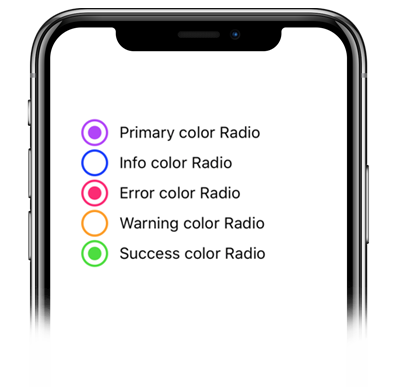
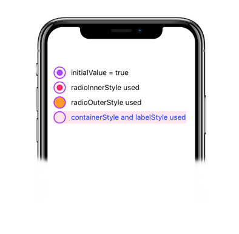

# Radio

Check out how awesome these radio buttons look! Who wouldn't want to use them?

### Usage
Imports:
```js
import { Radio } from 'galio-framework';
```

<p align="center">
  
</p>

Code example:
```jsx
<Radio label="Primary color Radio" color="primary"  />
<Radio label="Info color Radio" color="info"  />
<Radio label="Error color Radio" color="error"  />
<Radio label="Warning color Radio" color="warning"  />
<Radio label="Success color Radio" color="success"  />
```

<p align="center">
  
</p>

Code example:
```jsx
<Radio label="initialValue = true" initialValue />
<Radio label="radioInnerStyle used" initialValue radioInnerStyle={{ backgroundColor: "#FE2472" }} />
<Radio label="radioOuterStyle used" radioOuterStyle={{ backgroundColor: '#FF9C09' }} />
<Radio label="containerStyle and labelStyle used" containerStyle={{ backgroundColor: "#FE247220" }} labelStyle={{ color: '#1232FF' }} />
```

### Props

|       Prop      |                                  Type                                 |  Default  | Description |
|:---------------:|:---------------------------------------------------------------------:|:---------:|:-----------:|
|      color      |                                 string                                | 'primary' |             |
|  containerStyle |                                  any                                  |           |             |
| radioOuterStyle |                                  any                                  |           |             |
| radioInnerStyle |                                  any                                  |           |             |
|     disabled    |                                  bool                                 |   false   |             |
|  flexDirection  | oneOfType(['row', 'row-reverse', 'column', 'column-reverse']), string |   'row'   |             |
|   initialValue  |                                  bool                                 |   false   |             |
|      label      |                                 string                                |    null   |             |
|    labelStyle   |                                  any                                  |    null   |             |
|     onChange    |                                function                               |  () => {} |             |